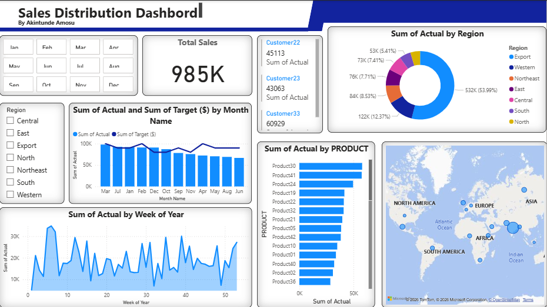

# Sales Distribution Dashboard

## Project Overview

This project analyzes sales distribution across regions, products, and time using an interactive Power BI dashboard. The goal is to identify sales patterns, top-performing products, and regional performance.

---

## Dashboard Preview

---

## Key Metrics

The dashboard highlights the following key performance indicators:

* **Total Sales:** 985K
* **Customer Sales Performance**
* **Regional Sales Distribution**
* **Product Sales Performance**

---

## Visualizations Included

### 1. Total Sales KPI

A KPI card displaying total revenue generated across all sales transactions.

### 2. Sales by Region

A donut chart showing how total sales are distributed across different regions such as:

* Western
* Central
* East
* South
* North
* Export

This helps identify which regions contribute the most revenue.

### 3. Sales vs Target by Month

A combined bar and line chart comparing:

* Actual Sales
* Target Sales

This helps measure performance against business goals.

### 4. Product Performance

A bar chart highlighting the top-selling products based on total revenue.

### 5. Weekly Sales Trend

A time-series line chart showing how sales fluctuate across weeks in a year.

### 6. Geographic Sales Distribution

A world map visualizing sales activity across different global locations.

---

## Interactive Filters

Users can filter the dashboard by:

* Month
* Region
* Customer

This allows deeper analysis of specific sales segments.

---

## Tools Used

* Power BI
* Microsoft Excel
* Data Cleaning
* Data Visualization
* Business Intelligence Dashboarding
